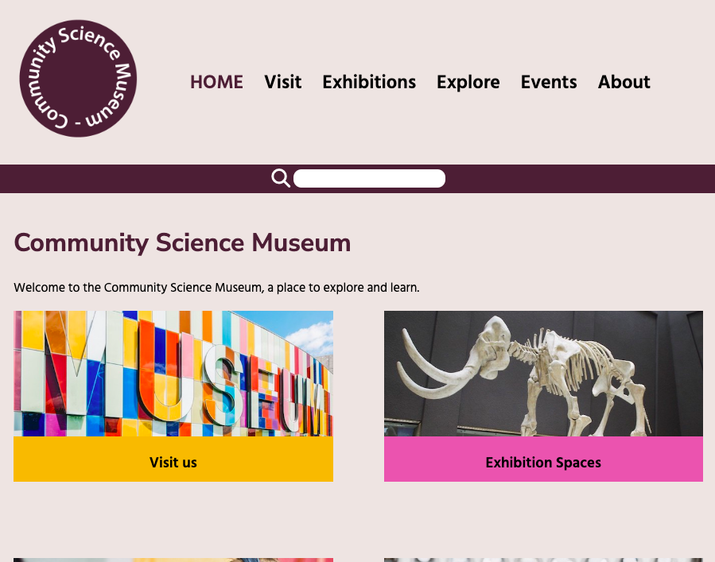

# Semester Project 1 – Community Science Museum



The Community Science Museum is committed to making science accessible to all.

## Description

This project is a course delivery after the first semester for Front End Development students at Noroff, covering design, HTML and CSS.

The Community Science Museum is a new museum in town, and their target audience is children aged 7-15 and families with children.

The website is responsive across devices.

## Built with

- HTML
- CSS

## Getting started

### Installing

It is easy for you to get this project started:

1. Clone the repository:

```bash
git clone git@github.com:VReinhaug/semester-project1
```

2. Install the dependencies:

```
npm install
```

### Running

To run the app, run the following command:

```
npm run start
```

## Contact

For any feedback or questions, please contact me [on LinkedIn](https://www.linkedin.com/in/veronika-reinhaug/).
